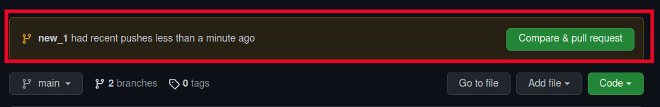

# Learn-Earn-in-WEB3 🕸️3


As we all know that the blockchain is the most rated , in demand technology.So for this am planning to list

all the website/organization which help's <b>beginner to learn blockchain</b> 😄 with <b>earning</b> 

Anyone can  upskill their  knowledge ,<b>showcase your project</b> ,skill and learn more.
```
 Most important thing is that you will also get job(full time / intern) on the basis of 
 your skill,project and performance  .
```
<h3>So what are you waiting for Go and sign up , ♥️ Welcome to learn with earn  process, enjoy the path 🤟</h3>

<hr>

| Organization Name | Link for the organization | Desacription |
|---|---|---|
|Pointer|[pointer](https://www.pointer.gg/)|Earn by completing the project related to the blockchain.This community has great project that u can level up your portfolio/resume 😃|
|StackUpHQ|[StackUpHQ](https://app.stackup.dev/)|If u are complete or u know coding or have some knowledge on the web2 then this is for you<br>Earn in dollar’s to learn stuff.|
|layer3xyz|[ layer3xyz](https://beta.layer3.xyz/)|Layer3 is a platform that enables anyone to contribute to a DAO. They provide a marketplace of bounties where users can earn governance tokens by doing things as simple as putting out a tweet or as complex as re-designing a front-end|
|Phemex learn and earn|[Phemex learn and earn](https://phemex.com/learn-crypto)|Learn & Earn is a brand new Phemex educational program that compensates you simply for learning new crypto, blockchain, and platform knowledge.|
|pyme_team|[pyme_team](https://pyme.team/)|Showcase your skills. Earn Crypto. Get hired. Be awesome.Get paid instantly . Earn crypto and NFTs for completing short tasks.|
|Coinmarketcap earn|[Coinmarketcap earn](https://coinmarketcap.com/earn/)|CoinMarketCap has partnered with trusted & emerging projects to offer an easy way to learn about cryptocurrency, earning cryptoassets as a reward.  You can complete the project related to the web3 on their site’s and earn crypto .|
|Binance learn and earn|[Binance learn and earn](https://www.binance.com/en/support/announcement/5aee07d467314086ab204ed92ee1bbaa)|This is for beginner as well as advanced/experiance developer ,they can complete the learning track’s or make project on web3 to get paid|
|Cake DeFi learn and earn|[Cake DeFi learn and earn](https://app.cakedefi.com/learn)| Get paid by completing the project ,quizes and module's|
|Questbook Learn and earn|[Questbook Learn and earn](https://openquest.xyz/)|Get paid by completing the each Module ,quizes,lesson's (for complete beginner)|
|Kucoin|[Kucoin](https://www.kucoin.com/land/task-center)|By completing task u can earn crypto |
|SuperteamTalent|[SuperteamTalent](https://superteam.fun/)|U can learn as well as find job as a blockchain developer in this organization for free . Get instant jobs, paid in tokens.🙂 💙|

<h1> ⭐ How to get started?</h1>

- Create an issue 
   <br /> <br />
 
- SUbmit the issue by clicking on the submit button
  <br />  <br />
  

- fork the repository <br />
  <br /> <br />

- clone the repository using Git command <br />
  <br/>  <br/>
  &nbsp; git clone https://github.com/Vikash-8090-Yadav/Learn-Earn-in-WEB3.git
- move to the newly created folder using
  Git command <br />
  &nbsp; ```cd Learn-Earn-in-WEB3/```
- open in your text editor
- make a new branch and then make the changes.<br/> For making new branch , use this Git command
   <br/> &nbsp; ```git checkout -b {new branch name}```
- check your changes using command
<br/> &nbsp; ```git status```
- save your changes by using command <br/>
&nbsp; ``` git add .```
- commit your changes using command <br/>
 &nbsp; ```git commit -m "your_commit_message"```
- to push your changes to github. Use command
<br/> &nbsp; ```git push origin new_branch_name``` 

# Raising Your 1st PR <br/>

- After pushing your code, go to the forked repository. There you will see change like this. <br />
 <br>
- click on compare and pull request. Such page will appear. Write meaningfull message and title which describes your changes<br/>
<br/> 
- click on create pull request. <br/>

Show some ❤️&nbsp; by giving  to this repo 
  
